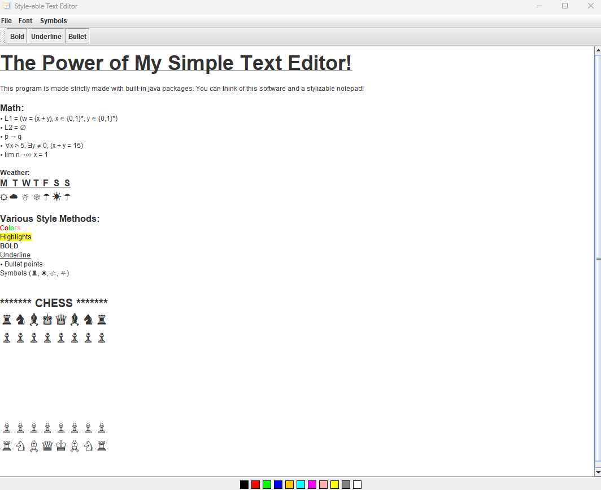
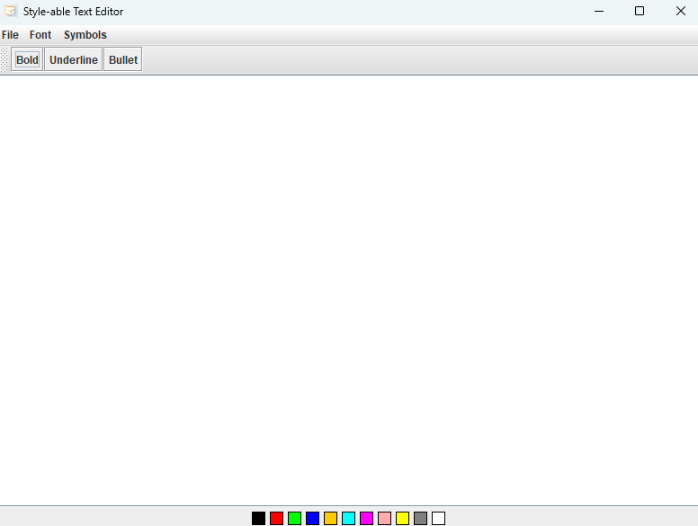
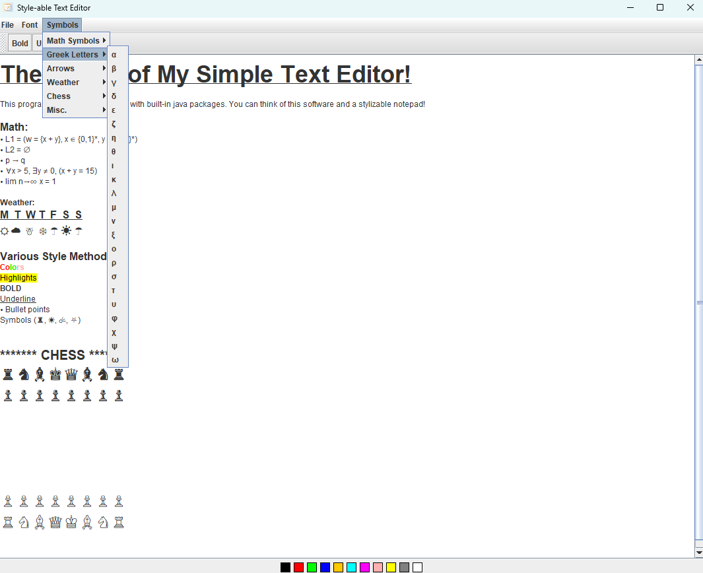

# Text Editor


Example of the text editor in action.

## Overview
This is a simple yet powerful text editor built using Java Swing. It supports basic text editing features, such as bold, underline, bullet points, text color, and highlighting. Additionally, it allows users to insert images into the document and save/load files in both plain text and RTF formats.

## Features

### Text Styling:
- **Bold**
- **Underline**
- **Bullet points**
- **Change text color**
- **Highlight text**

### File Operations:
- Create new files.
- Open existing files (supports .txt and .rtf formats).
- Save files (supports .txt and .rtf formats).

### Undo/Redo:
- Supports undo and redo operations for text editing.

### User-Friendly Interface:
- Intuitive design with easy-to-use menus and toolbars.

## How to Use

### 1. Running the Application
To run the text editor, follow these steps:
1. Ensure you have Java installed on your system.
2. Clone this repository or download the source code.
3. Compile the Java files:

   ```
   javac *.java
   ```

4. Run the application:

   ```
   java TextEditor
   ```

### 2. Basic Operations
- **New File**: Create a new document.
- **Open File**: Open an existing .txt or .rtf file.
- **Save File**: Save the current document as .txt or .rtf.
- **Save As**: Save the document with a new name or format.

### 3. Text Styling
- **Bold**: Select text and click the Bold button or press Ctrl+B.
- **Underline**: Select text and click the Underline button or press Ctrl+U.
- **Bullet Points**: Select text and click the Bullet Points button to add or remove bullet points.
- **Text Color**: Select text and choose a color from the color swatch.
- **Highlight**: Select text and choose a highlight color from the color swatch.


## Screenshots

### Main Interface

The main interface of the text editor.

### Inserting Symbols

A screenshot of some of the symbols included.

## How to Add Images to the README

To include images in your README file:

1. **Create an images folder in your project directory.**
2. Add your images (e.g., `text-editor-screenshot.png`) to the images folder.
3. Use the following Markdown syntax to embed images in the README:

   ```
   
   ```

   Example:

   ```
   
   ```

## Dependencies
- **Java Swing**: The project uses Java Swing for the graphical user interface.
- **Java AWT**: Used for color selection and basic graphics.


Enjoy using the text editor! 🚀
